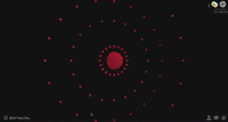

# Greetings and Welcome to BEAT SALON&copy;!

[beatsalon.xyz](http://beatsalon.xyz) <---- check out our awesome project!

### How to use 
1. ENTER and select the "+" button at the top right corner  
2. Search for a song and click "+" button to the right of the video   
3. WAIT PATIENTLY for the audio file to load  
4. Enjoy! Different visualization can be selected by clicking on the bottom left menu bar  

This is a music visualizer!  

What it basically does is the following: it allows users to search songs from Youtube and visualize the beat into the screen.

The search function shows the top viewed videos and returns them to the modal frame.

Have fun with it and please leave comments on our page!

We had some difficulties making our project compatible to mobile webapps.(ex. safari/ chrome mobile)

If possible, use the site on full screen!

### Screen shots 

### We have used:  
* Django 1.9
* Processing
* p5.js
* youtube-dl
* django-bootstrap3
* ffmpeg

### References
* https://github.com/jcalazan/youtube-audio-dl
* https://github.com/therewasaguy/p5-music-viz

#### Developed by ByungJae Kim, KyungYun Lee, Jooeun Ahn, Hyerin Rhee, Hyun Joong Kim 
#### Launched on August 12th, 2016 
